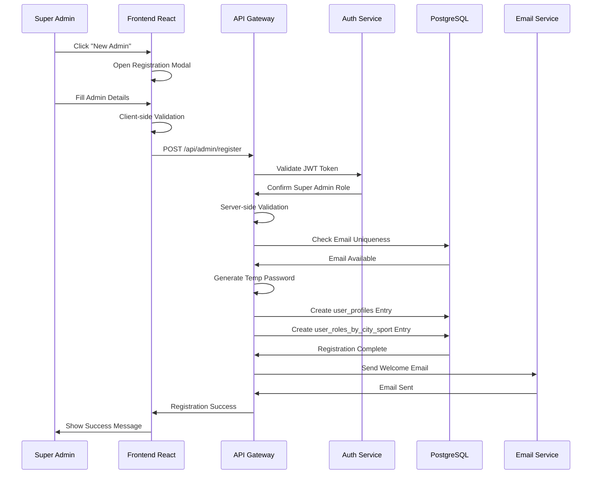

# Documento de Diseño - Sistema de Registro de Administradores

## Overview

El sistema de registro de administradores se integra completamente con la arquitectura existente de Mowe Sport, utilizando el esquema `user_profiles` implementado, las políticas RLS configuradas y el sistema de roles granulares. El diseño se enfoca en seguridad, validación exhaustiva y experiencia de usuario fluida.

## Architecture

### Flujo de Registro de Administrador



## Components and Interfaces

### Frontend Components

#### AdminRegistrationModal Component

```typescript
interface AdminRegistrationFormData {
  // Campos básicos de user_profiles
  first_name: string;
  last_name: string;
  email: string;
  phone?: string;
  identification?: string;
  
  // Campos para asignación de roles
  city_id: string;
  sport_id: string;
  
  // Campos de configuración inicial
  account_status: 'active' | 'suspended' | 'payment_pending' | 'disabled';
  is_active: boolean;
  
  // Campos opcionales
  photo_url?: string;
}

interface AdminRegistrationModalProps {
  isOpen: boolean;
  onClose: () => void;
  onSuccess: (admin: UserProfile) => void;
}

interface ValidationErrors {
  first_name?: string;
  last_name?: string;
  email?: string;
  phone?: string;
  identification?: string;
  city_id?: string;
  sport_id?: string;
}
```

#### Hooks para Gestión de Estado

```typescript
// Hook para gestión del formulario
const useAdminRegistrationForm = () => {
  const [formData, setFormData] = useState<AdminRegistrationFormData>();
  const [errors, setErrors] = useState<ValidationErrors>({});
  const [isLoading, setIsLoading] = useState(false);
  
  const validateForm = (): boolean => { /* validación */ };
  const submitForm = async (): Promise<void> => { /* envío */ };
  const resetForm = (): void => { /* reset */ };
  
  return { formData, errors, isLoading, validateForm, submitForm, resetForm };
};

// Hook para cargar datos de ciudades y deportes
const useCitiesAndSports = () => {
  const [cities, setCities] = useState<City[]>([]);
  const [sports, setSports] = useState<Sport[]>([]);
  const [loading, setLoading] = useState(true);
  
  useEffect(() => {
    // Cargar datos desde API
  }, []);
  
  return { cities, sports, loading };
};
```

### Backend API Design

#### Admin Registration Endpoint

```go
// Request struct para registro de admin
type AdminRegistrationRequest struct {
    FirstName      string  `json:"first_name" validate:"required,min=2,max=100"`
    LastName       string  `json:"last_name" validate:"required,min=2,max=100"`
    Email          string  `json:"email" validate:"required,email"`
    Phone          *string `json:"phone,omitempty" validate:"omitempty,phone"`
    Identification *string `json:"identification,omitempty" validate:"omitempty,min=5,max=50"`
    CityID         string  `json:"city_id" validate:"required,uuid"`
    SportID        string  `json:"sport_id" validate:"required,uuid"`
    AccountStatus  string  `json:"account_status" validate:"required,oneof=active suspended payment_pending disabled"`
    PhotoURL       *string `json:"photo_url,omitempty" validate:"omitempty,url"`
}

// Response struct para registro exitoso
type AdminRegistrationResponse struct {
    UserID           uuid.UUID `json:"user_id"`
    Email            string    `json:"email"`
    FirstName        string    `json:"first_name"`
    LastName         string    `json:"last_name"`
    TempPassword     string    `json:"temp_password"` // Solo en desarrollo
    RoleAssignmentID uuid.UUID `json:"role_assignment_id"`
    Message          string    `json:"message"`
}

// Service para registro de administradores
type AdminRegistrationService struct {
    db           *sql.DB
    emailService EmailService
    logger       Logger
}

func (s *AdminRegistrationService) RegisterAdmin(
    ctx context.Context, 
    req AdminRegistrationRequest, 
    createdBy uuid.UUID,
) (*AdminRegistrationResponse, error) {
    // 1. Validar permisos del usuario que registra
    if err := s.validateSuperAdminPermissions(ctx, createdBy); err != nil {
        return nil, err
    }
    
    // 2. Validar unicidad de email
    if err := s.validateEmailUniqueness(ctx, req.Email); err != nil {
        return nil, err
    }
    
    // 3. Validar existencia de ciudad y deporte
    if err := s.validateCityAndSport(ctx, req.CityID, req.SportID); err != nil {
        return nil, err
    }
    
    // 4. Generar contraseña temporal
    tempPassword := s.generateTempPassword()
    passwordHash, err := s.hashPassword(tempPassword)
    if err != nil {
        return nil, err
    }
    
    // 5. Iniciar transacción
    tx, err := s.db.BeginTx(ctx, nil)
    if err != nil {
        return nil, err
    }
    defer tx.Rollback()
    
    // 6. Crear usuario en user_profiles
    userID, err := s.createUserProfile(ctx, tx, req, passwordHash)
    if err != nil {
        return nil, err
    }
    
    // 7. Asignar rol en user_roles_by_city_sport
    roleAssignmentID, err := s.assignCityAdminRole(ctx, tx, userID, req.CityID, req.SportID, createdBy)
    if err != nil {
        return nil, err
    }
    
    // 8. Commit transacción
    if err := tx.Commit(); err != nil {
        return nil, err
    }
    
    // 9. Enviar email de bienvenida
    go s.sendWelcomeEmail(req.Email, req.FirstName, tempPassword)
    
    // 10. Log de auditoría
    s.logAdminRegistration(userID, req, createdBy)
    
    return &AdminRegistrationResponse{
        UserID:           userID,
        Email:            req.Email,
        FirstName:        req.FirstName,
        LastName:         req.LastName,
        TempPassword:     tempPassword, // Solo en desarrollo
        RoleAssignmentID: roleAssignmentID,
        Message:          "Admin registered successfully. Welcome email sent.",
    }, nil
}
```

#### Database Operations

```go
// Crear entrada en user_profiles
func (s *AdminRegistrationService) createUserProfile(
    ctx context.Context, 
    tx *sql.Tx, 
    req AdminRegistrationRequest, 
    passwordHash string,
) (uuid.UUID, error) {
    userID := uuid.New()
    
    query := `
        INSERT INTO user_profiles (
            user_id, email, password_hash, first_name, last_name, 
            phone, identification, photo_url, primary_role, 
            is_active, account_status, created_at, updated_at
        ) VALUES (
            $1, $2, $3, $4, $5, $6, $7, $8, $9, $10, $11, NOW(), NOW()
        )`
    
    _, err := tx.ExecContext(ctx, query,
        userID, req.Email, passwordHash, req.FirstName, req.LastName,
        req.Phone, req.Identification, req.PhotoURL, RoleCityAdmin,
        true, req.AccountStatus,
    )
    
    return userID, err
}

// Asignar rol granular por ciudad/deporte
func (s *AdminRegistrationService) assignCityAdminRole(
    ctx context.Context, 
    tx *sql.Tx, 
    userID uuid.UUID, 
    cityID, sportID string, 
    assignedBy uuid.UUID,
) (uuid.UUID, error) {
    roleAssignmentID := uuid.New()
    cityUUID, _ := uuid.Parse(cityID)
    sportUUID, _ := uuid.Parse(sportID)
    
    query := `
        INSERT INTO user_roles_by_city_sport (
            role_assignment_id, user_id, city_id, sport_id, 
            role_name, assigned_by_user_id, is_active, created_at
        ) VALUES (
            $1, $2, $3, $4, $5, $6, $7, NOW()
        )`
    
    _, err := tx.ExecContext(ctx, query,
        roleAssignmentID, userID, cityUUID, sportUUID,
        RoleCityAdmin, assignedBy, true,
    )
    
    return roleAssignmentID, err
}
```

### Email Service Integration

```go
type WelcomeEmailData struct {
    FirstName    string
    Email        string
    TempPassword string
    LoginURL     string
    SupportEmail string
}

func (s *AdminRegistrationService) sendWelcomeEmail(
    email, firstName, tempPassword string,
) error {
    data := WelcomeEmailData{
        FirstName:    firstName,
        Email:        email,
        TempPassword: tempPassword,
        LoginURL:     s.config.FrontendURL + "/login",
        SupportEmail: s.config.SupportEmail,
    }
    
    return s.emailService.SendTemplate(
        email,
        "Bienvenido a Mowe Sport - Credenciales de Administrador",
        "admin_welcome_template",
        data,
    )
}
```

## Data Models

### Extended Form Data Model

```typescript
// Modelo completo para el formulario de registro
interface AdminRegistrationForm {
  // Información personal (requerida)
  first_name: string;
  last_name: string;
  email: string;
  
  // Información de contacto (opcional)
  phone?: string;
  identification?: string;
  
  // Asignación de jurisdicción (requerida)
  city_id: string;
  sport_id: string;
  
  // Configuración de cuenta
  account_status: AccountStatus;
  is_active: boolean;
  
  // Información adicional (opcional)
  photo_url?: string;
}

// Modelos para dropdowns
interface City {
  city_id: string;
  name: string;
  region?: string;
  country: string;
}

interface Sport {
  sport_id: string;
  name: string;
  description?: string;
}

// Estados de validación
interface FormValidation {
  isValid: boolean;
  errors: Record<string, string>;
  touched: Record<string, boolean>;
}
```

### Database Schema Integration

El sistema utiliza las tablas existentes:

```sql
-- user_profiles: Tabla principal de usuarios
-- user_roles_by_city_sport: Roles granulares por ciudad/deporte
-- cities: Catálogo de ciudades
-- sports: Catálogo de deportes

-- Vista para consulta de administradores con sus asignaciones
CREATE VIEW admin_assignments AS
SELECT 
    up.user_id,
    up.email,
    up.first_name,
    up.last_name,
    up.phone,
    up.account_status,
    up.is_active,
    up.created_at,
    c.name as city_name,
    s.name as sport_name,
    ur.role_assignment_id,
    ur.is_active as role_active
FROM user_profiles up
JOIN user_roles_by_city_sport ur ON up.user_id = ur.user_id
JOIN cities c ON ur.city_id = c.city_id
JOIN sports s ON ur.sport_id = s.sport_id
WHERE up.primary_role = 'city_admin'
ORDER BY up.created_at DESC;
```

## Error Handling

### Validation Errors

```typescript
// Tipos de errores de validación
enum ValidationErrorType {
  REQUIRED = 'REQUIRED',
  INVALID_FORMAT = 'INVALID_FORMAT',
  DUPLICATE_VALUE = 'DUPLICATE_VALUE',
  INVALID_REFERENCE = 'INVALID_REFERENCE',
  PERMISSION_DENIED = 'PERMISSION_DENIED'
}

interface ValidationError {
  field: string;
  type: ValidationErrorType;
  message: string;
  code: string;
}

// Manejo de errores en el frontend
const handleRegistrationError = (error: ApiError) => {
  if (error.code === 'VALIDATION_ERROR') {
    setFieldErrors(error.details.validation_errors);
  } else if (error.code === 'DUPLICATE_EMAIL') {
    setFieldErrors({ email: 'Este email ya está registrado' });
  } else if (error.code === 'PERMISSION_DENIED') {
    showNotification('No tienes permisos para registrar administradores', 'error');
  } else {
    showNotification('Error interno del servidor', 'error');
  }
};
```

### Backend Error Responses

```go
// Errores específicos del registro de admin
var (
    ErrEmailAlreadyExists = errors.New("email already exists")
    ErrInvalidCityOrSport = errors.New("invalid city or sport reference")
    ErrPermissionDenied   = errors.New("permission denied: super admin required")
    ErrInvalidPhoneFormat = errors.New("invalid phone number format")
)

// Estructura de respuesta de error
type ErrorResponse struct {
    Code    string      `json:"code"`
    Message string      `json:"message"`
    Details interface{} `json:"details,omitempty"`
}

// Manejo centralizado de errores
func (h *AdminHandler) handleRegistrationError(c echo.Context, err error) error {
    switch {
    case errors.Is(err, ErrEmailAlreadyExists):
        return c.JSON(http.StatusConflict, ErrorResponse{
            Code:    "DUPLICATE_EMAIL",
            Message: "El email ya está registrado en el sistema",
        })
    case errors.Is(err, ErrPermissionDenied):
        return c.JSON(http.StatusForbidden, ErrorResponse{
            Code:    "PERMISSION_DENIED",
            Message: "Solo Super Administradores pueden registrar administradores",
        })
    default:
        return c.JSON(http.StatusInternalServerError, ErrorResponse{
            Code:    "INTERNAL_ERROR",
            Message: "Error interno del servidor",
        })
    }
}
```

## Security Considerations

### Authentication & Authorization

```go
// Middleware para validar permisos de Super Admin
func RequireSuperAdmin(next echo.HandlerFunc) echo.HandlerFunc {
    return func(c echo.Context) error {
        user := c.Get("user").(*jwt.Token)
        claims := user.Claims.(*JWTClaims)
        
        if claims.PrimaryRole != RoleSuperAdmin {
            return echo.NewHTTPError(http.StatusForbidden, "Super Admin required")
        }
        
        return next(c)
    }
}

// Validación de permisos en el servicio
func (s *AdminRegistrationService) validateSuperAdminPermissions(
    ctx context.Context, 
    userID uuid.UUID,
) error {
    var role string
    err := s.db.QueryRowContext(ctx, 
        "SELECT primary_role FROM user_profiles WHERE user_id = $1", 
        userID,
    ).Scan(&role)
    
    if err != nil {
        return err
    }
    
    if role != RoleSuperAdmin {
        return ErrPermissionDenied
    }
    
    return nil
}
```

### Input Validation & Sanitization

```go
// Validación exhaustiva de inputs
func (s *AdminRegistrationService) validateRequest(req AdminRegistrationRequest) error {
    // Validar email
    if !isValidEmail(req.Email) {
        return errors.New("invalid email format")
    }
    
    // Validar teléfono si se proporciona
    if req.Phone != nil && !isValidPhone(*req.Phone) {
        return errors.New("invalid phone format")
    }
    
    // Validar identificación si se proporciona
    if req.Identification != nil && !isValidIdentification(*req.Identification) {
        return errors.New("invalid identification format")
    }
    
    // Sanitizar strings
    req.FirstName = sanitizeString(req.FirstName)
    req.LastName = sanitizeString(req.LastName)
    
    return nil
}

// Funciones de validación
func isValidEmail(email string) bool {
    emailRegex := regexp.MustCompile(`^[a-zA-Z0-9._%+-]+@[a-zA-Z0-9.-]+\.[a-zA-Z]{2,}$`)
    return emailRegex.MatchString(email)
}

func isValidPhone(phone string) bool {
    phoneRegex := regexp.MustCompile(`^\+?[1-9]\d{1,14}$`)
    return phoneRegex.MatchString(phone)
}

func sanitizeString(input string) string {
    // Remover caracteres peligrosos
    return html.EscapeString(strings.TrimSpace(input))
}
```

## Testing Strategy

### Frontend Testing

```typescript
// Test del componente de registro
describe('AdminRegistrationModal', () => {
  it('should validate required fields', async () => {
    render(<AdminRegistrationModal isOpen={true} onClose={jest.fn()} onSuccess={jest.fn()} />);
    
    fireEvent.click(screen.getByText('Guardar'));
    
    expect(screen.getByText('Nombre es requerido')).toBeInTheDocument();
    expect(screen.getByText('Email es requerido')).toBeInTheDocument();
  });
  
  it('should submit valid form data', async () => {
    const mockOnSuccess = jest.fn();
    render(<AdminRegistrationModal isOpen={true} onClose={jest.fn()} onSuccess={mockOnSuccess} />);
    
    fireEvent.change(screen.getByLabelText('Nombre'), { target: { value: 'Juan' } });
    fireEvent.change(screen.getByLabelText('Email'), { target: { value: 'juan@test.com' } });
    // ... llenar otros campos
    
    fireEvent.click(screen.getByText('Guardar'));
    
    await waitFor(() => {
      expect(mockOnSuccess).toHaveBeenCalled();
    });
  });
});
```

### Backend Testing

```go
// Test del servicio de registro
func TestAdminRegistrationService_RegisterAdmin(t *testing.T) {
    // Setup
    db := setupTestDB(t)
    service := NewAdminRegistrationService(db, mockEmailService, mockLogger)
    
    t.Run("successful registration", func(t *testing.T) {
        req := AdminRegistrationRequest{
            FirstName:     "Juan",
            LastName:      "Pérez",
            Email:         "juan@test.com",
            CityID:        "city-uuid",
            SportID:       "sport-uuid",
            AccountStatus: "active",
        }
        
        result, err := service.RegisterAdmin(context.Background(), req, superAdminID)
        
        assert.NoError(t, err)
        assert.NotEmpty(t, result.UserID)
        assert.Equal(t, req.Email, result.Email)
    })
    
    t.Run("duplicate email error", func(t *testing.T) {
        // Crear usuario existente
        createTestUser(t, db, "existing@test.com")
        
        req := AdminRegistrationRequest{
            Email: "existing@test.com",
            // ... otros campos
        }
        
        _, err := service.RegisterAdmin(context.Background(), req, superAdminID)
        
        assert.Error(t, err)
        assert.Contains(t, err.Error(), "email already exists")
    })
}
```

## Performance Considerations

### Database Optimization

```sql
-- Índices para optimizar consultas de registro
CREATE INDEX CONCURRENTLY idx_user_profiles_email_unique ON user_profiles(email) WHERE email IS NOT NULL;
CREATE INDEX CONCURRENTLY idx_user_roles_city_sport_lookup ON user_roles_by_city_sport(city_id, sport_id, role_name);
CREATE INDEX CONCURRENTLY idx_user_profiles_role_status ON user_profiles(primary_role, account_status) WHERE is_active = true;
```

### Caching Strategy

```go
// Cache para ciudades y deportes (datos que cambian poco)
type CacheService struct {
    redis *redis.Client
}

func (c *CacheService) GetCitiesAndSports() ([]City, []Sport, error) {
    // Intentar obtener del cache
    citiesJSON, err := c.redis.Get("cities").Result()
    if err == nil {
        var cities []City
        json.Unmarshal([]byte(citiesJSON), &cities)
        
        sportsJSON, _ := c.redis.Get("sports").Result()
        var sports []Sport
        json.Unmarshal([]byte(sportsJSON), &sports)
        
        return cities, sports, nil
    }
    
    // Cache miss - obtener de DB y cachear
    cities, sports := c.loadFromDatabase()
    c.cacheData(cities, sports)
    
    return cities, sports, nil
}
```

Este diseño proporciona una base sólida para implementar el sistema completo de registro de administradores, integrándose perfectamente con tu arquitectura existente y siguiendo las mejores prácticas de seguridad y rendimiento.