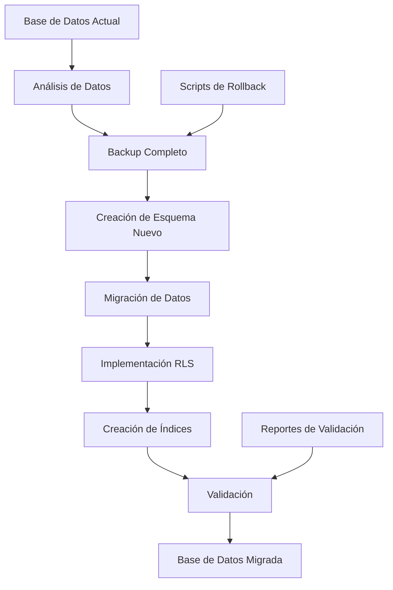

# Documento de Diseño - Migración de Base de Datos Mowe Sport

## Overview

Este documento describe el diseño técnico para migrar la tabla `users` existente al esquema completo de la plataforma Mowe Sport. La migración incluye la transformación de datos, creación de nuevas tablas, implementación de seguridad RLS, y optimización de rendimiento.

## Architecture

### Arquitectura de Migración



### Fases de Migración

1. **Fase de Preparación**: Análisis y backup
2. **Fase de Esquema**: Creación de tablas y estructura
3. **Fase de Datos**: Migración y transformación de datos
4. **Fase de Seguridad**: Implementación de RLS y políticas
5. **Fase de Optimización**: Creación de índices y funciones
6. **Fase de Validación**: Testing y verificación

## Components and Interfaces

### 1. Analizador de Esquema Actual

**Propósito**: Analizar la estructura actual y mapear campos al nuevo esquema.

**Funcionalidades**:
- Análisis de la tabla `users` existente
- Identificación de tipos de datos y restricciones
- Mapeo de campos antiguos a nuevos
- Detección de datos inconsistentes

### 2. Motor de Migración de Datos

**Propósito**: Transformar y migrar datos del esquema antiguo al nuevo.

**Funcionalidades**:
- Transformación de datos de usuarios
- Creación de registros en tablas relacionadas
- Manejo de valores nulos y defaults
- Validación de integridad referencial

### 3. Implementador de Seguridad

**Propósito**: Configurar RLS y políticas de seguridad.

**Funcionalidades**:
- Habilitación de RLS en tablas
- Creación de políticas por rol
- Configuración de funciones de seguridad
- Testing de políticas

### 4. Optimizador de Rendimiento

**Propósito**: Crear índices y optimizar consultas.

**Funcionalidades**:
- Creación de índices básicos y avanzados
- Análisis de rendimiento de consultas
- Optimización de estadísticas
- Monitoreo de uso de índices

## Data Models

### Mapeo de Campos Existentes

```sql
-- Mapeo de tabla users actual a user_profiles nueva
users.id → user_profiles.user_id (UUID)
users.email → user_profiles.email (TEXT)
users.name → user_profiles.first_name (TEXT)
users.last_name → user_profiles.last_name (TEXT)
users.phone → user_profiles.phone (TEXT)
users.document → user_profiles.identification (TEXT)
users.document_type → user_profiles.identification_type (TEXT)
users.role → user_profiles.primary_role (TEXT)
users.status → user_profiles.is_active (BOOLEAN)
users.created_at → user_profiles.created_at (TIMESTAMP)
users.updated_at → user_profiles.updated_at (TIMESTAMP)
```

### Nuevos Campos Requeridos

```sql
-- Campos adicionales en user_profiles
account_status TEXT DEFAULT 'active'
failed_login_attempts INTEGER DEFAULT 0
locked_until TIMESTAMP WITH TIME ZONE
last_login_at TIMESTAMP WITH TIME ZONE
photo_url TEXT
date_of_birth DATE
gender VARCHAR(10)
nationality VARCHAR(50)
address TEXT
emergency_contact_name TEXT
emergency_contact_phone TEXT
```

### Tablas Completamente Nuevas

1. **cities**: Gestión de ciudades
2. **sports**: Tipos de deportes
3. **user_roles_by_city_sport**: Roles granulares por ciudad/deporte
4. **tournaments**: Gestión de torneos
5. **teams**: Equipos deportivos
6. **players**: Información de jugadores
7. **matches**: Partidos y encuentros
8. **match_events**: Eventos durante partidos
9. **player_statistics**: Estadísticas de jugadores
10. **team_statistics**: Estadísticas de equipos
11. **audit_logs**: Auditoría del sistema
12. **user_view_permissions**: Permisos de vistas

## Error Handling

### Estrategias de Manejo de Errores

1. **Errores de Migración de Datos**:
   - Logging detallado de errores
   - Continuación con datos válidos
   - Reporte de registros problemáticos
   - Opciones de corrección manual

2. **Errores de Integridad Referencial**:
   - Validación previa a inserción
   - Creación de registros padre faltantes
   - Manejo de referencias circulares
   - Rollback parcial si es necesario

3. **Errores de RLS**:
   - Validación de políticas antes de aplicar
   - Testing con usuarios de prueba
   - Rollback de políticas problemáticas
   - Logging de intentos de acceso denegados

### Mecanismos de Rollback

```sql
-- Estructura de rollback por fases
CREATE TABLE migration_rollback_log (
    phase VARCHAR(50),
    operation VARCHAR(100),
    rollback_sql TEXT,
    executed_at TIMESTAMP DEFAULT NOW()
);
```

## Testing Strategy

### 1. Testing de Migración de Datos

**Pruebas Unitarias**:
- Validación de mapeo de campos
- Transformación de tipos de datos
- Manejo de valores nulos
- Integridad de datos migrados

**Pruebas de Integración**:
- Migración completa de usuarios
- Creación de relaciones entre tablas
- Validación de foreign keys
- Consistencia de datos

### 2. Testing de Seguridad RLS

**Pruebas de Políticas**:
- Acceso por rol de usuario
- Aislamiento de datos por ciudad
- Restricciones por deporte
- Escalación de privilegios

**Pruebas de Rendimiento**:
- Impacto de RLS en consultas
- Optimización de políticas
- Índices para políticas
- Monitoreo de rendimiento

### 3. Testing de Funciones y Triggers

**Pruebas Funcionales**:
- Cálculo de estadísticas
- Actualización automática de datos
- Triggers de auditoría
- Funciones de autenticación

### 4. Testing de Rollback

**Pruebas de Reversión**:
- Rollback completo de migración
- Rollback por fases
- Integridad después de rollback
- Recuperación de datos

## Implementation Plan

### Fase 1: Preparación (Estimado: 2 horas)

1. **Análisis de Datos Actuales**
   - Ejecutar queries de análisis en tabla users
   - Identificar patrones de datos
   - Detectar inconsistencias
   - Generar reporte de análisis

2. **Backup y Preparación**
   - Crear backup completo de base de datos
   - Configurar entorno de testing
   - Preparar scripts de migración
   - Configurar logging detallado

### Fase 2: Creación de Esquema (Estimado: 3 horas)

1. **Creación de Tablas Base**
   - Ejecutar scripts de schema core
   - Crear tablas de ciudades y deportes
   - Configurar user_profiles expandido
   - Establecer relaciones básicas

2. **Tablas de Gestión Deportiva**
   - Crear tablas de torneos y equipos
   - Configurar tablas de jugadores
   - Establecer relaciones many-to-many
   - Validar integridad referencial

### Fase 3: Migración de Datos (Estimado: 4 horas)

1. **Migración de Usuarios**
   - Transformar datos de users a user_profiles
   - Crear registros en user_roles_by_city_sport
   - Manejar campos faltantes con defaults
   - Validar datos migrados

2. **Datos Iniciales**
   - Insertar ciudades y deportes básicos
   - Crear roles administrativos iniciales
   - Configurar permisos básicos
   - Validar estructura de datos

### Fase 4: Implementación de Seguridad (Estimado: 3 horas)

1. **Configuración RLS**
   - Habilitar RLS en todas las tablas
   - Crear políticas por tabla y rol
   - Implementar funciones de seguridad
   - Testing básico de políticas

2. **Funciones de Autenticación**
   - Implementar funciones de login
   - Configurar manejo de intentos fallidos
   - Crear funciones de auditoría
   - Testing de seguridad

### Fase 5: Optimización (Estimado: 2 horas)

1. **Creación de Índices**
   - Implementar índices básicos
   - Crear índices avanzados
   - Optimizar para consultas comunes
   - Monitorear rendimiento

2. **Funciones de Estadísticas**
   - Implementar funciones de cálculo
   - Crear triggers automáticos
   - Testing de rendimiento
   - Validar cálculos

### Fase 6: Validación Final (Estimado: 2 horas)

1. **Testing Completo**
   - Ejecutar suite de pruebas
   - Validar integridad de datos
   - Testing de rendimiento
   - Verificar funcionalidades

2. **Documentación y Entrega**
   - Generar reporte de migración
   - Documentar cambios realizados
   - Crear guía de rollback
   - Entrega final

## Performance Considerations

### Optimizaciones de Migración

1. **Procesamiento por Lotes**
   - Migrar usuarios en lotes de 1000
   - Commits periódicos para evitar locks largos
   - Monitoreo de memoria y CPU
   - Pausas entre lotes si es necesario

2. **Índices Temporales**
   - Crear índices temporales para migración
   - Eliminar índices no necesarios durante migración
   - Recrear índices optimizados al final
   - Análisis de uso de índices

3. **Paralelización**
   - Migración paralela de tablas independientes
   - Procesamiento concurrente donde sea seguro
   - Sincronización de dependencias
   - Monitoreo de recursos

### Monitoreo de Rendimiento

```sql
-- Queries de monitoreo durante migración
SELECT 
    schemaname,
    tablename,
    n_tup_ins,
    n_tup_upd,
    n_tup_del
FROM pg_stat_user_tables 
WHERE schemaname = 'public';

-- Monitoreo de locks
SELECT 
    mode,
    locktype,
    database,
    relation,
    page,
    tuple,
    classid,
    granted
FROM pg_locks;
```

## Security Considerations

### Seguridad Durante Migración

1. **Acceso Restringido**
   - Migración en horario de mantenimiento
   - Acceso limitado a usuarios administrativos
   - Monitoreo de conexiones activas
   - Logging de todas las operaciones

2. **Validación de Datos Sensibles**
   - Encriptación de datos sensibles
   - Validación de integridad de passwords
   - Manejo seguro de tokens de recuperación
   - Auditoría de cambios de permisos

3. **Testing de Seguridad Post-Migración**
   - Validación de políticas RLS
   - Testing de escalación de privilegios
   - Verificación de aislamiento de datos
   - Auditoría de accesos

## Rollback Strategy

### Plan de Rollback por Fases

1. **Rollback Completo**
   - Restauración desde backup completo
   - Tiempo estimado: 30 minutos
   - Pérdida de datos: Todos los cambios post-migración

2. **Rollback Parcial por Fases**
   - Reversión de fases específicas
   - Mantenimiento de datos compatibles
   - Tiempo variable según fase
   - Pérdida mínima de datos

3. **Rollback de Emergencia**
   - Procedimiento rápido para problemas críticos
   - Restauración a estado funcional mínimo
   - Tiempo estimado: 10 minutos
   - Investigación posterior de problemas

### Scripts de Rollback Automático

```sql
-- Ejemplo de script de rollback para user_profiles
CREATE OR REPLACE FUNCTION rollback_user_profiles_migration()
RETURNS VOID AS $$
BEGIN
    -- Restaurar tabla users original
    DROP TABLE IF EXISTS public.user_profiles CASCADE;
    
    -- Recrear estructura original
    CREATE TABLE public.users (
        id SERIAL PRIMARY KEY,
        email VARCHAR NOT NULL,
        password_hash VARCHAR NOT NULL,
        -- ... resto de campos originales
    );
    
    -- Restaurar datos desde backup
    -- (implementación específica según método de backup)
END;
$$ LANGUAGE plpgsql;
```