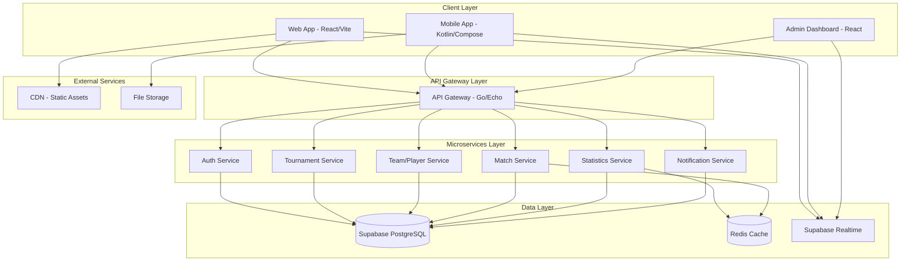
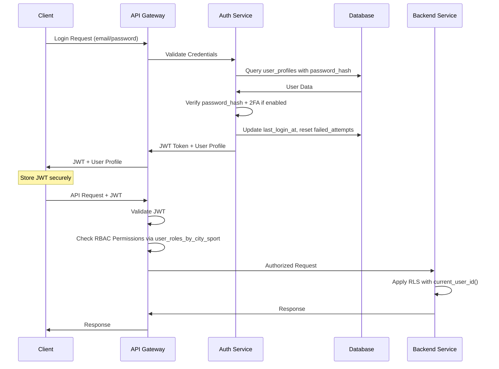

# Documento de Diseño - Plataforma Mowe Sport

IMPORTATE TODO SE TIENE QUE TRABAJAR EN INGELES TANTO PARA NOMBRAR LAS VARIABLES LAS FUNCIONES TODO TIENE QUE ESTAR EN INGELS, MENOS LOS CHATS CON KIRO. ESTO ES PARA TENER UN BUENA ORGANIZACION Y LEGIBILIDAD, TAMBIEN SE TIENE QUE TRABAJAR CON SNAKE_CASE PARA NOMBRAR LAS VARIABLES.

Recomendaciones:
Utiliza nombres que reflejen el propósito de la variable. 
Asegúrate de que los nombres sean fáciles de leer y entender. 
Evita nombres demasiado cortos o vagos que puedan generar confusión. 
Si usas abreviaturas, asegúrate de que sean comúnmente entendidas. 
Considera las convenciones de nomenclatura de tu equipo o proyecto para mantener la consistencia. 

# Stack:

### database: 
 - Supabase - PostgreSQL

### Back-End:
 - Go
 - Echo

### Front-End:
 - Typescript
 - React
 - Tailwind
 - Vite
 - HeroUI

## Overview

El diseño de Mowe Sport se basa en una arquitectura de microservicios escalable que aprovecha las fortalezas de Go para el backend, React con Vite para el frontend, y Supabase como base de datos principal. La arquitectura está diseñada para soportar 100,000 usuarios concurrentes con tiempos de respuesta menores a 2 segundos y 99.9% de disponibilidad.

**Estado Actual**: Esquema básico implementado. Necesitamos completar la tabla `user_profiles` con autenticación y implementar el sistema completo.

## Architecture

### High-Level Architecture



### Service Architecture Details

#### 1. API Gateway (Go/Echo)
- **Responsabilidad**: Punto de entrada único, enrutamiento, autenticación JWT, rate limiting
- **Tecnología**: Go con framework Echo
- **Características**:
  - Middleware de autenticación JWT
  - Middleware RBAC personalizado
  - Rate limiting por usuario/IP
  - Request/Response logging
  - CORS handling

#### 2. Authentication Service
- **Responsabilidad**: Gestión de usuarios, roles, 2FA
- **Integración**: Sistema de autenticación personalizado con JWT
- **Características**:
  - Registro/Login con password_hash personalizado
  - Gestión de roles granulares (Super Admin, Admin, Propietario, etc.)
  - 2FA con TOTP para administradores
  - JWT token management personalizado
  - Password policies y recuperación con tokens
  - Bloqueo progresivo de cuentas por intentos fallidos

#### 3. Tournament Service
- **Responsabilidad**: CRUD de torneos, aprobaciones, programación
- **Características**:
  - Creación y gestión de torneos
  - Sistema de aprobación por administradores
  - Programación de partidos
  - Gestión de inscripciones de equipos

#### 4. Team/Player Service
- **Responsabilidad**: Gestión de equipos, jugadores y sus relaciones
- **Características**:
  - CRUD de equipos y jugadores
  - Gestión de relaciones muchos-a-muchos (jugador-equipo)
  - Historial de participaciones
  - Validación de elegibilidad

#### 5. Match Service
- **Responsabilidad**: Gestión de partidos, eventos en tiempo real
- **Características**:
  - CRUD de partidos
  - Registro de eventos en tiempo real
  - Cálculo automático de resultados
  - Integración con Supabase Realtime

#### 6. Statistics Service
- **Responsabilidad**: Cálculo y agregación de estadísticas
- **Características**:
  - Cálculo de estadísticas de jugadores/equipos
  - Generación de clasificaciones
  - Caché de estadísticas frecuentes
  - Reportes y analytics

## Components and Interfaces

### Database Schema (Supabase PostgreSQL)

#### Core Tables

```sql
-- Cities table
CREATE TABLE cities (
    city_id UUID PRIMARY KEY DEFAULT gen_random_uuid(),
    name VARCHAR(100) NOT NULL,
    region VARCHAR(100),
    country VARCHAR(100) NOT NULL,
    created_at TIMESTAMP DEFAULT NOW()
);

-- Sports table
CREATE TABLE sports (
    sport_id UUID PRIMARY KEY DEFAULT gen_random_uuid(),
    name VARCHAR(100) NOT NULL,
    description TEXT,
    rules JSONB,
    created_at TIMESTAMP DEFAULT NOW()
);

-- User profiles table (main user table with authentication)
CREATE TABLE user_profiles (
    user_id UUID PRIMARY KEY DEFAULT gen_random_uuid(),
    email VARCHAR(255) NOT NULL UNIQUE,
    password_hash VARCHAR(255) NOT NULL,
    first_name VARCHAR(100) NOT NULL,
    last_name VARCHAR(100) NOT NULL,
    phone VARCHAR(20),
    identification VARCHAR(50),
    photo_url TEXT,
    primary_role VARCHAR(20) CHECK (primary_role IN ('super_admin', 'city_admin', 'tournament_admin', 'owner', 'coach', 'referee', 'player', 'client')),
    is_active BOOLEAN DEFAULT TRUE,
    account_status VARCHAR(20) DEFAULT 'active' CHECK (account_status IN ('active', 'suspended', 'payment_pending', 'disabled')),
    last_login_at TIMESTAMP,
    failed_login_attempts INTEGER DEFAULT 0,
    locked_until TIMESTAMP,
    token_recovery VARCHAR(255),
    token_expiration_date TIMESTAMP,
    two_factor_secret VARCHAR(255),
    two_factor_enabled BOOLEAN DEFAULT FALSE,
    created_at TIMESTAMP DEFAULT NOW(),
    updated_at TIMESTAMP DEFAULT NOW()
);

-- User roles by city/sport (granular role management)
CREATE TABLE user_roles_by_city_sport (
    role_assignment_id UUID PRIMARY KEY DEFAULT gen_random_uuid(),
    user_id UUID NOT NULL REFERENCES user_profiles(user_id),
    city_id UUID REFERENCES cities(city_id),
    sport_id UUID REFERENCES sports(sport_id),
    role_name VARCHAR(20) NOT NULL CHECK (role_name IN ('city_admin', 'tournament_admin', 'owner', 'coach', 'referee', 'player', 'client')),
    assigned_by_user_id UUID REFERENCES user_profiles(user_id),
    is_active BOOLEAN DEFAULT TRUE,
    created_at TIMESTAMP DEFAULT NOW(),
    UNIQUE(user_id, city_id, sport_id, role_name)
);

-- User permissions and view restrictions
CREATE TABLE user_view_permissions (
    permission_id UUID PRIMARY KEY DEFAULT gen_random_uuid(),
    user_id UUID REFERENCES user_profiles(user_id),
    role_name VARCHAR(20),
    view_name VARCHAR(100) NOT NULL,
    is_allowed BOOLEAN DEFAULT TRUE,
    configured_by_user_id UUID NOT NULL REFERENCES user_profiles(user_id),
    created_at TIMESTAMP DEFAULT NOW(),
    updated_at TIMESTAMP DEFAULT NOW()
);

-- Tournaments table
CREATE TABLE tournaments (
    tournament_id UUID PRIMARY KEY DEFAULT gen_random_uuid(),
    name VARCHAR(200) NOT NULL,
    description TEXT,
    city_id UUID NOT NULL REFERENCES cities(city_id),
    sport_id UUID NOT NULL REFERENCES sports(sport_id),
    admin_user_id UUID NOT NULL REFERENCES user_profiles(user_id),
    start_date DATE NOT NULL,
    end_date DATE NOT NULL,
    registration_deadline DATE,
    max_teams INTEGER,
    status VARCHAR(20) DEFAULT 'pending' CHECK (status IN ('pending', 'approved', 'active', 'completed', 'cancelled')),
    is_public BOOLEAN DEFAULT TRUE,
    rules JSONB,
    created_at TIMESTAMP DEFAULT NOW(),
    updated_at TIMESTAMP DEFAULT NOW()
);

-- Teams table
CREATE TABLE teams (
    team_id UUID PRIMARY KEY DEFAULT gen_random_uuid(),
    name VARCHAR(200) NOT NULL,
    description TEXT,
    owner_user_id UUID NOT NULL REFERENCES user_profiles(user_id),
    city_id UUID NOT NULL REFERENCES cities(city_id),
    sport_id UUID NOT NULL REFERENCES sports(sport_id),
    logo_url TEXT,
    founded_date DATE,
    is_active BOOLEAN DEFAULT TRUE,
    created_at TIMESTAMP DEFAULT NOW(),
    updated_at TIMESTAMP DEFAULT NOW()
);

-- Players table
CREATE TABLE players (
    player_id UUID PRIMARY KEY DEFAULT gen_random_uuid(),
    user_profile_id UUID REFERENCES user_profiles(user_id), -- If player has user account
    first_name VARCHAR(100) NOT NULL,
    last_name VARCHAR(100) NOT NULL,
    date_of_birth DATE NOT NULL,
    identification VARCHAR(50) UNIQUE NOT NULL,
    blood_type VARCHAR(5),
    email VARCHAR(255),
    phone VARCHAR(20),
    photo_url TEXT,
    emergency_contact JSONB,
    medical_info JSONB,
    is_active BOOLEAN DEFAULT TRUE,
    created_at TIMESTAMP DEFAULT NOW(),
    updated_at TIMESTAMP DEFAULT NOW()
);

-- Many-to-many relationships
CREATE TABLE tournament_teams (
    tournament_team_id UUID PRIMARY KEY DEFAULT gen_random_uuid(),
    tournament_id UUID NOT NULL REFERENCES tournaments(tournament_id),
    team_id UUID NOT NULL REFERENCES teams(team_id),
    registration_date TIMESTAMP DEFAULT NOW(),
    status VARCHAR(20) DEFAULT 'pending' CHECK (status IN ('pending', 'approved', 'rejected')),
    approved_by_user_id UUID REFERENCES user_profiles(user_id),
    created_at TIMESTAMP DEFAULT NOW(),
    UNIQUE(tournament_id, team_id)
);

CREATE TABLE team_players (
    team_player_id UUID PRIMARY KEY DEFAULT gen_random_uuid(),
    team_id UUID NOT NULL REFERENCES teams(team_id),
    player_id UUID NOT NULL REFERENCES players(player_id),
    join_date DATE NOT NULL DEFAULT CURRENT_DATE,
    leave_date DATE,
    is_active BOOLEAN DEFAULT TRUE,
    position VARCHAR(50),
    jersey_number INTEGER,
    registered_by_user_id UUID NOT NULL REFERENCES user_profiles(user_id),
    created_at TIMESTAMP DEFAULT NOW(),
    -- Constraint to prevent same player in multiple teams of same sport/category/tournament
    CONSTRAINT unique_player_sport_tournament UNIQUE(player_id, team_id, join_date)
);

-- Matches table
CREATE TABLE matches (
    match_id UUID PRIMARY KEY DEFAULT gen_random_uuid(),
    tournament_id UUID NOT NULL REFERENCES tournaments(tournament_id),
    sport_id UUID NOT NULL REFERENCES sports(sport_id),
    team1_id UUID NOT NULL REFERENCES teams(team_id),
    team2_id UUID NOT NULL REFERENCES teams(team_id),
    match_date DATE NOT NULL,
    match_time TIME NOT NULL,
    location VARCHAR(200),
    referee_user_id UUID REFERENCES user_profiles(user_id),
    score_team1 INTEGER DEFAULT 0,
    score_team2 INTEGER DEFAULT 0,
    status VARCHAR(20) DEFAULT 'scheduled' CHECK (status IN ('scheduled', 'live', 'completed', 'cancelled', 'postponed')),
    match_data JSONB, -- Additional match metadata
    created_at TIMESTAMP DEFAULT NOW(),
    updated_at TIMESTAMP DEFAULT NOW()
);

-- Match events table
CREATE TABLE match_events (
    event_id UUID PRIMARY KEY DEFAULT gen_random_uuid(),
    match_id UUID NOT NULL REFERENCES matches(match_id),
    player_id UUID REFERENCES players(player_id),
    team_id UUID NOT NULL REFERENCES teams(team_id),
    event_type VARCHAR(50) NOT NULL, -- 'goal', 'yellow_card', 'red_card', 'substitution', etc.
    event_time INTEGER NOT NULL, -- Minutes from match start
    description TEXT,
    event_data JSONB, -- Additional event metadata
    created_at TIMESTAMP DEFAULT NOW()
);

-- Statistics tables
CREATE TABLE player_statistics (
    stat_id UUID PRIMARY KEY DEFAULT gen_random_uuid(),
    player_id UUID NOT NULL REFERENCES players(player_id),
    tournament_id UUID NOT NULL REFERENCES tournaments(tournament_id),
    team_id UUID NOT NULL REFERENCES teams(team_id),
    sport_id UUID NOT NULL REFERENCES sports(sport_id),
    matches_played INTEGER DEFAULT 0,
    goals_scored INTEGER DEFAULT 0,
    assists INTEGER DEFAULT 0,
    yellow_cards INTEGER DEFAULT 0,
    red_cards INTEGER DEFAULT 0,
    minutes_played INTEGER DEFAULT 0,
    wins INTEGER DEFAULT 0,
    losses INTEGER DEFAULT 0,
    draws INTEGER DEFAULT 0,
    additional_stats JSONB, -- Sport-specific statistics
    updated_at TIMESTAMP DEFAULT NOW(),
    UNIQUE(player_id, tournament_id, team_id)
);

CREATE TABLE team_statistics (
    stat_id UUID PRIMARY KEY DEFAULT gen_random_uuid(),
    team_id UUID NOT NULL REFERENCES teams(team_id),
    tournament_id UUID NOT NULL REFERENCES tournaments(tournament_id),
    sport_id UUID NOT NULL REFERENCES sports(sport_id),
    matches_played INTEGER DEFAULT 0,
    wins INTEGER DEFAULT 0,
    losses INTEGER DEFAULT 0,
    draws INTEGER DEFAULT 0,
    goals_for INTEGER DEFAULT 0,
    goals_against INTEGER DEFAULT 0,
    points INTEGER DEFAULT 0,
    position INTEGER,
    additional_stats JSONB, -- Sport-specific statistics
    updated_at TIMESTAMP DEFAULT NOW(),
    UNIQUE(team_id, tournament_id)
);
```

### Row Level Security (RLS) Policies

#### Multi-Tenant Security Implementation

```sql
-- Enable RLS on all tables
ALTER TABLE tournaments ENABLE ROW LEVEL SECURITY;
ALTER TABLE teams ENABLE ROW LEVEL SECURITY;
ALTER TABLE matches ENABLE ROW LEVEL SECURITY;
ALTER TABLE player_statistics ENABLE ROW LEVEL SECURITY;
ALTER TABLE team_statistics ENABLE ROW LEVEL SECURITY;

-- Tournament policies
CREATE POLICY "Admins can manage tournaments in their city/sport" ON tournaments
FOR ALL TO authenticated
USING (
    EXISTS (
        SELECT 1 FROM user_profiles up
        JOIN user_roles_by_city_sport ur ON up.user_id = ur.user_id
        WHERE up.user_id = current_user_id() 
        AND ur.role_name IN ('super_admin', 'city_admin')
        AND (ur.role_name = 'super_admin' OR 
             (ur.city_id = tournaments.city_id AND ur.sport_id = tournaments.sport_id))
        AND ur.is_active = TRUE
    )
);

CREATE POLICY "Public can view public tournaments" ON tournaments
FOR SELECT TO anon, authenticated
USING (is_public = TRUE);

CREATE POLICY "Team owners can view tournaments they participate in" ON tournaments
FOR SELECT TO authenticated
USING (
    EXISTS (
        SELECT 1 FROM tournament_teams tt
        JOIN teams t ON tt.team_id = t.team_id
        WHERE tt.tournament_id = tournaments.tournament_id
        AND t.owner_user_id = current_user_id()
    )
);

-- Team policies
CREATE POLICY "Team owners can manage their teams" ON teams
FOR ALL TO authenticated
USING (owner_user_id = current_user_id());

CREATE POLICY "Admins can view teams in their city/sport" ON teams
FOR SELECT TO authenticated
USING (
    EXISTS (
        SELECT 1 FROM user_profiles up
        JOIN user_roles_by_city_sport ur ON up.user_id = ur.user_id
        WHERE up.user_id = current_user_id() 
        AND ur.role_name IN ('super_admin', 'city_admin')
        AND (ur.role_name = 'super_admin' OR 
             (ur.city_id = teams.city_id AND ur.sport_id = teams.sport_id))
        AND ur.is_active = TRUE
    )
);

-- Similar policies for other tables...
```

## Data Models

### Core Domain Models (Go Structs)

```go
// UserProfile represents a system user profile with authentication
type UserProfile struct {
    UserID              uuid.UUID     `json:"user_id" db:"user_id"`
    Email               string        `json:"email" db:"email"`
    PasswordHash        string        `json:"-" db:"password_hash"` // Never expose in JSON
    FirstName           string        `json:"first_name" db:"first_name"`
    LastName            string        `json:"last_name" db:"last_name"`
    Phone               *string       `json:"phone" db:"phone"`
    Identification      *string       `json:"identification" db:"identification"`
    PhotoURL            *string       `json:"photo_url" db:"photo_url"`
    PrimaryRole         UserRole      `json:"primary_role" db:"primary_role"`
    IsActive            bool          `json:"is_active" db:"is_active"`
    AccountStatus       AccountStatus `json:"account_status" db:"account_status"`
    LastLoginAt         *time.Time    `json:"last_login_at" db:"last_login_at"`
    FailedLoginAttempts int           `json:"failed_login_attempts" db:"failed_login_attempts"`
    LockedUntil         *time.Time    `json:"locked_until" db:"locked_until"`
    TokenRecovery       *string       `json:"-" db:"token_recovery"` // Never expose in JSON
    TokenExpirationDate *time.Time    `json:"-" db:"token_expiration_date"` // Never expose in JSON
    TwoFactorSecret     *string       `json:"-" db:"two_factor_secret"` // Never expose in JSON
    TwoFactorEnabled    bool          `json:"two_factor_enabled" db:"two_factor_enabled"`
    CreatedAt           time.Time     `json:"created_at" db:"created_at"`
    UpdatedAt           time.Time     `json:"updated_at" db:"updated_at"`
}

type UserRole string

const (
    RoleSuperAdmin      UserRole = "super_admin"
    RoleCityAdmin       UserRole = "city_admin"
    RoleTournamentAdmin UserRole = "tournament_admin"
    RoleOwner           UserRole = "owner"
    RoleCoach           UserRole = "coach"
    RoleReferee         UserRole = "referee"
    RolePlayer          UserRole = "player"
    RoleClient          UserRole = "client"
)

type AccountStatus string

const (
    AccountActive         AccountStatus = "active"
    AccountSuspended      AccountStatus = "suspended"
    AccountPaymentPending AccountStatus = "payment_pending"
    AccountDisabled       AccountStatus = "disabled"
)

// UserRoleByCitySport represents granular role assignments
type UserRoleByCitySport struct {
    RoleAssignmentID  uuid.UUID  `json:"role_assignment_id" db:"role_assignment_id"`
    UserID            uuid.UUID  `json:"user_id" db:"user_id"`
    CityID            *uuid.UUID `json:"city_id" db:"city_id"`
    SportID           *uuid.UUID `json:"sport_id" db:"sport_id"`
    RoleName          UserRole   `json:"role_name" db:"role_name"`
    AssignedByUserID  *uuid.UUID `json:"assigned_by_user_id" db:"assigned_by_user_id"`
    IsActive          bool       `json:"is_active" db:"is_active"`
    CreatedAt         time.Time  `json:"created_at" db:"created_at"`
}

// UserViewPermission represents view-level permissions
type UserViewPermission struct {
    PermissionID       uuid.UUID `json:"permission_id" db:"permission_id"`
    UserID             *uuid.UUID `json:"user_id" db:"user_id"`
    RoleName           *string   `json:"role_name" db:"role_name"`
    ViewName           string    `json:"view_name" db:"view_name"`
    IsAllowed          bool      `json:"is_allowed" db:"is_allowed"`
    ConfiguredByUserID uuid.UUID `json:"configured_by_user_id" db:"configured_by_user_id"`
    CreatedAt          time.Time `json:"created_at" db:"created_at"`
    UpdatedAt          time.Time `json:"updated_at" db:"updated_at"`
}

// Player represents a sports player
type Player struct {
    PlayerID         uuid.UUID  `json:"player_id" db:"player_id"`
    UserProfileID    *uuid.UUID `json:"user_profile_id" db:"user_profile_id"`
    FirstName        string     `json:"first_name" db:"first_name"`
    LastName         string     `json:"last_name" db:"last_name"`
    DateOfBirth      time.Time  `json:"date_of_birth" db:"date_of_birth"`
    Identification   string     `json:"identification" db:"identification"`
    BloodType        *string    `json:"blood_type" db:"blood_type"`
    Email            *string    `json:"email" db:"email"`
    Phone            *string    `json:"phone" db:"phone"`
    PhotoURL         *string    `json:"photo_url" db:"photo_url"`
    EmergencyContact *json.RawMessage `json:"emergency_contact" db:"emergency_contact"`
    MedicalInfo      *json.RawMessage `json:"medical_info" db:"medical_info"`
    IsActive         bool       `json:"is_active" db:"is_active"`
    CreatedAt        time.Time  `json:"created_at" db:"created_at"`
    UpdatedAt        time.Time  `json:"updated_at" db:"updated_at"`
}

// Tournament represents a sports tournament
type Tournament struct {
    TournamentID         uuid.UUID      `json:"tournament_id" db:"tournament_id"`
    Name                 string         `json:"name" db:"name"`
    Description          *string        `json:"description" db:"description"`
    CityID               uuid.UUID      `json:"city_id" db:"city_id"`
    SportID              uuid.UUID      `json:"sport_id" db:"sport_id"`
    AdminUserID          uuid.UUID      `json:"admin_user_id" db:"admin_user_id"`
    StartDate            time.Time      `json:"start_date" db:"start_date"`
    EndDate              time.Time      `json:"end_date" db:"end_date"`
    RegistrationDeadline *time.Time     `json:"registration_deadline" db:"registration_deadline"`
    MaxTeams             *int           `json:"max_teams" db:"max_teams"`
    Status               TournamentStatus `json:"status" db:"status"`
    IsPublic             bool           `json:"is_public" db:"is_public"`
    Rules                *json.RawMessage `json:"rules" db:"rules"`
    CreatedAt            time.Time      `json:"created_at" db:"created_at"`
    UpdatedAt            time.Time      `json:"updated_at" db:"updated_at"`
}

type TournamentStatus string

const (
    TournamentPending   TournamentStatus = "pending"
    TournamentApproved  TournamentStatus = "approved"
    TournamentActive    TournamentStatus = "active"
    TournamentCompleted TournamentStatus = "completed"
    TournamentCancelled TournamentStatus = "cancelled"
)

// Match represents a sports match
type Match struct {
    MatchID      uuid.UUID    `json:"match_id" db:"match_id"`
    TournamentID uuid.UUID    `json:"tournament_id" db:"tournament_id"`
    SportID      uuid.UUID    `json:"sport_id" db:"sport_id"`
    Team1ID      uuid.UUID    `json:"team1_id" db:"team1_id"`
    Team2ID      uuid.UUID    `json:"team2_id" db:"team2_id"`
    MatchDate    time.Time    `json:"match_date" db:"match_date"`
    MatchTime    time.Time    `json:"match_time" db:"match_time"`
    Location     *string      `json:"location" db:"location"`
    RefereeUserID *uuid.UUID  `json:"referee_user_id" db:"referee_user_id"`
    ScoreTeam1   int          `json:"score_team1" db:"score_team1"`
    ScoreTeam2   int          `json:"score_team2" db:"score_team2"`
    Status       MatchStatus  `json:"status" db:"status"`
    MatchData    *json.RawMessage `json:"match_data" db:"match_data"`
    CreatedAt    time.Time    `json:"created_at" db:"created_at"`
    UpdatedAt    time.Time    `json:"updated_at" db:"updated_at"`
}

type MatchStatus string

const (
    MatchScheduled MatchStatus = "scheduled"
    MatchLive      MatchStatus = "live"
    MatchCompleted MatchStatus = "completed"
    MatchCancelled MatchStatus = "cancelled"
    MatchPostponed MatchStatus = "postponed"
)

// MatchEvent represents events that occur during a match
type MatchEvent struct {
    EventID     uuid.UUID        `json:"event_id" db:"event_id"`
    MatchID     uuid.UUID        `json:"match_id" db:"match_id"`
    PlayerID    *uuid.UUID       `json:"player_id" db:"player_id"`
    TeamID      uuid.UUID        `json:"team_id" db:"team_id"`
    EventType   string           `json:"event_type" db:"event_type"`
    EventTime   int              `json:"event_time" db:"event_time"`
    Description *string          `json:"description" db:"description"`
    EventData   *json.RawMessage `json:"event_data" db:"event_data"`
    CreatedAt   time.Time        `json:"created_at" db:"created_at"`
}
```

## Error Handling

### Error Response Structure

```go
type APIError struct {
    Code    string `json:"code"`
    Message string `json:"message"`
    Details interface{} `json:"details,omitempty"`
}

type APIResponse struct {
    Success bool        `json:"success"`
    Data    interface{} `json:"data,omitempty"`
    Error   *APIError   `json:"error,omitempty"`
}
```

### Error Categories

1. **Authentication Errors** (401)
   - Invalid JWT token
   - Expired token
   - Missing authentication

2. **Authorization Errors** (403)
   - Insufficient permissions
   - RLS policy violation
   - Role-based access denied

3. **Validation Errors** (400)
   - Invalid input data
   - Missing required fields
   - Business rule violations

4. **Not Found Errors** (404)
   - Resource not found
   - Invalid resource ID

5. **Conflict Errors** (409)
   - Duplicate resource
   - Constraint violations

6. **Server Errors** (500)
   - Database connection issues
   - Internal service errors
   - Third-party service failures

## Testing Strategy

### Unit Testing
- **Backend**: Go testing package with testify for assertions
- **Frontend**: Jest + React Testing Library
- **Coverage Target**: 80% minimum

### Integration Testing
- **API Testing**: Postman/Newman for automated API testing
- **Database Testing**: Test database with sample data
- **Real-time Testing**: WebSocket connection testing

### End-to-End Testing
- **Web**: Playwright for browser automation
- **Mobile**: Espresso/UI Automator for Android
- **Cross-platform**: Critical user journeys

### Performance Testing
- **Load Testing**: Artillery.js for API load testing
- **Database Performance**: pgbench for PostgreSQL
- **Frontend Performance**: Lighthouse CI

### Security Testing
- **OWASP ZAP**: Automated security scanning
- **SQL Injection**: Automated testing with sqlmap
- **Authentication**: JWT security testing
- **RLS Testing**: Row-level security validation

## Performance Considerations

### Caching Strategy (Redis)

```go
// Cache patterns implementation
type CacheService struct {
    client *redis.Client
}

// Cache-aside pattern for frequently accessed data
func (c *CacheService) GetTournamentStandings(tournamentID uuid.UUID) (*Standings, error) {
    key := fmt.Sprintf("standings:%s", tournamentID)
    
    // Try cache first
    cached, err := c.client.Get(context.Background(), key).Result()
    if err == nil {
        var standings Standings
        json.Unmarshal([]byte(cached), &standings)
        return &standings, nil
    }
    
    // Cache miss - get from database
    standings, err := c.calculateStandings(tournamentID)
    if err != nil {
        return nil, err
    }
    
    // Cache for 5 minutes
    standingsJSON, _ := json.Marshal(standings)
    c.client.Set(context.Background(), key, standingsJSON, 5*time.Minute)
    
    return standings, nil
}
```

### Database Optimization

```sql
-- Critical indexes for performance
CREATE INDEX idx_tournaments_city_sport ON tournaments(city_id, sport_id);
CREATE INDEX idx_matches_tournament_date ON matches(tournament_id, match_date);
CREATE INDEX idx_match_events_match_time ON match_events(match_id, event_time);
CREATE INDEX idx_player_stats_tournament ON player_statistics(tournament_id, goals_scored DESC);
CREATE INDEX idx_team_stats_tournament ON team_statistics(tournament_id, points DESC);

-- Partial indexes for active records
CREATE INDEX idx_active_tournaments ON tournaments(city_id, sport_id) WHERE status IN ('approved', 'active');
CREATE INDEX idx_live_matches ON matches(tournament_id, match_date) WHERE status = 'live';
```

### Real-time Optimization

```javascript
// Frontend real-time subscription optimization
const useMatchUpdates = (matchId) => {
  const [matchData, setMatchData] = useState(null);
  
  useEffect(() => {
    const subscription = supabase
      .channel(`match:${matchId}`)
      .on('postgres_changes', {
        event: '*',
        schema: 'public',
        table: 'matches',
        filter: `match_id=eq.${matchId}`
      }, (payload) => {
        setMatchData(payload.new);
      })
      .on('postgres_changes', {
        event: 'INSERT',
        schema: 'public',
        table: 'match_events',
        filter: `match_id=eq.${matchId}`
      }, (payload) => {
        // Handle new match events
        updateMatchEvents(payload.new);
      })
      .subscribe();
    
    return () => subscription.unsubscribe();
  }, [matchId]);
  
  return matchData;
};
```

## Security Architecture

### Authentication Flow



### Security Layers

1. **Transport Security**: HTTPS/TLS 1.3
2. **Authentication**: Custom JWT + password_hash + 2FA TOTP
3. **Authorization**: RBAC + RLS + View-level permissions
4. **Input Validation**: Server-side validation
5. **Output Encoding**: XSS prevention
6. **CSRF Protection**: Token-based
7. **Rate Limiting**: Per-user/IP limits
8. **Account Security**: Login attempt limiting, progressive locking
9. **Audit Logging**: Security event logging
10. **Session Management**: Single session per device, automatic logout
11. **Password Recovery**: Secure token-based with expiration

### Enhanced Authentication Features

#### Login Security Implementation

```go
type LoginAttemptService struct {
    db *sql.DB
}

func (s *LoginAttemptService) ValidateLoginAttempt(userID uuid.UUID) error {
    var attempts int
    var lockedUntil *time.Time
    
    err := s.db.QueryRow(`
        SELECT failed_login_attempts, locked_until 
        FROM user_profiles 
        WHERE user_id = $1
    `, userID).Scan(&attempts, &lockedUntil)
    
    if err != nil {
        return err
    }
    
    // Check if account is locked
    if lockedUntil != nil && time.Now().Before(*lockedUntil) {
        return errors.New("account_locked")
    }
    
    // Check if attempts exceed limit
    if attempts >= 5 {
        lockDuration := 15 * time.Minute
        if attempts >= 10 { // Second offense
            lockDuration = 24 * time.Hour
        }
        
        lockUntil := time.Now().Add(lockDuration)
        _, err = s.db.Exec(`
            UPDATE user_profiles 
            SET locked_until = $1 
            WHERE user_id = $2
        `, lockUntil, userID)
        
        return errors.New("account_locked_due_to_attempts")
    }
    
    return nil
}

func (s *LoginAttemptService) RecordFailedAttempt(userID uuid.UUID) error {
    _, err := s.db.Exec(`
        UPDATE user_profiles 
        SET failed_login_attempts = failed_login_attempts + 1 
        WHERE user_id = $1
    `, userID)
    return err
}

func (s *LoginAttemptService) ResetFailedAttempts(userID uuid.UUID) error {
    _, err := s.db.Exec(`
        UPDATE user_profiles 
        SET failed_login_attempts = 0, locked_until = NULL, last_login_at = NOW()
        WHERE user_id = $1
    `, userID)
    return err
}
```

#### Account Status Management

```go
type AccountStatus string

const (
    StatusActive         AccountStatus = "active"
    StatusSuspended      AccountStatus = "suspended"
    StatusPaymentPending AccountStatus = "payment_pending"
    StatusDisabled       AccountStatus = "disabled"
)

func (s *UserService) UpdateAccountStatus(userID uuid.UUID, status AccountStatus, updatedBy uuid.UUID) error {
    _, err := s.db.Exec(`
        UPDATE user_profiles 
        SET account_status = $1, updated_at = NOW()
        WHERE user_id = $2
    `, status, userID)
    
    if err != nil {
        return err
    }
    
    // Log the status change
    return s.auditLogger.LogAccountStatusChange(userID, status, updatedBy)
}
```