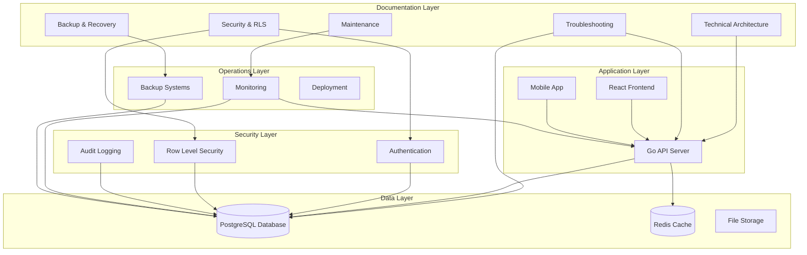

# Mowe Sport - Complete System Documentation

## Overview

Welcome to the comprehensive documentation for the Mowe Sport platform. This documentation covers all aspects of the system including technical architecture, security implementation, maintenance procedures, and operational guidelines.

## Documentation Structure

### 📋 Core Documentation

#### [Technical Architecture](./technical-architecture.md)
Complete technical architecture documentation covering:
- High-level system architecture
- Database schema and design
- API architecture and endpoints
- Security architecture
- Performance considerations
- Real-time architecture
- Deployment architecture
- Technology stack details

#### [Security and RLS Documentation](./security-rls-documentation.md)
Comprehensive security implementation guide covering:
- Row Level Security (RLS) policies
- Multi-tenant security model
- Authentication functions
- Password management
- Account security
- Two-factor authentication
- Security monitoring
- Best practices

#### [Troubleshooting Guide](./troubleshooting-guide.md)
Complete troubleshooting reference covering:
- Database issues and solutions
- Authentication problems
- RLS policy issues
- Performance problems
- API and backend issues
- Frontend issues
- Deployment issues
- Emergency procedures

#### [Maintenance and Operations](./maintenance-operations.md)
Operational procedures and maintenance tasks:
- Daily operations checklist
- Database maintenance
- Performance monitoring
- Security maintenance
- System updates
- Emergency response procedures
- Incident management

#### [Backup and Recovery Procedures](./backup-recovery-procedures.md)
Complete backup and disaster recovery guide:
- Backup strategies and schedules
- Automated backup systems
- Recovery procedures
- Disaster recovery planning
- Testing and validation
- Cloud backup configuration

### 📊 Testing and Validation Reports

#### [Task 7: Comprehensive Testing Report](./task7-comprehensive-testing-report.md)
Complete system testing validation results:
- System-wide testing results
- Data integrity validation
- Security testing outcomes
- Performance benchmarks
- RLS policy testing
- Authentication validation

## Quick Start Guide

### For Developers

1. **Read the Technical Architecture** - Start with [technical-architecture.md](./technical-architecture.md) to understand the system design
2. **Review Security Implementation** - Study [security-rls-documentation.md](./security-rls-documentation.md) for security patterns
3. **Set up Development Environment** - Follow the setup instructions in the main README
4. **Run Tests** - Execute the testing tools in `cmd/test-*` directories

### For System Administrators

1. **Review Operations Guide** - Start with [maintenance-operations.md](./maintenance-operations.md)
2. **Set up Monitoring** - Implement the monitoring procedures outlined
3. **Configure Backups** - Follow [backup-recovery-procedures.md](./backup-recovery-procedures.md)
4. **Test Recovery Procedures** - Run quarterly recovery drills

### For Security Teams

1. **Security Architecture Review** - Study [security-rls-documentation.md](./security-rls-documentation.md)
2. **Run Security Tests** - Execute `cmd/security-testing/main.go`
3. **Review RLS Policies** - Test with `cmd/test-rls/main.go`
4. **Monitor Security Events** - Set up security monitoring procedures

## System Architecture Overview

## Key Features Documented

### 🔐 Security Features
- **Multi-tenant Row Level Security**: Complete isolation between cities and sports
- **Advanced Authentication**: JWT + 2FA + progressive account locking
- **Password Security**: Strength validation, secure hashing, recovery tokens
- **Audit Logging**: Comprehensive security event tracking
- **Role-based Access Control**: Granular permissions by role and context

### 🏗️ Architecture Features
- **Microservices Design**: Scalable service-oriented architecture
- **Real-time Updates**: Supabase Realtime integration for live match updates
- **Performance Optimization**: Strategic indexing and caching
- **Multi-tenancy**: City and sport-based data isolation
- **API Gateway**: Centralized authentication and routing

### 🛠️ Operational Features
- **Automated Backups**: Daily, weekly, and monthly backup strategies
- **Disaster Recovery**: Complete recovery procedures and testing
- **Performance Monitoring**: Real-time system and database monitoring
- **Health Checks**: Automated system health validation
- **Emergency Procedures**: Step-by-step incident response

## Testing Framework

The system includes comprehensive testing tools:

### Database Testing
- **System Validation**: `cmd/test-system/main.go`
- **Data Integrity**: `cmd/test-data-integrity/main.go`
- **Performance Testing**: `cmd/test-performance/main.go`

### Security Testing
- **RLS Policy Testing**: `cmd/test-rls/main.go`
- **Security Penetration**: `cmd/security-testing/main.go`
- **Authentication Testing**: `cmd/test-auth-security/main.go`

### Validation Results
- **Overall System**: 86.6% tests passed (71/82 tests)
- **Data Integrity**: 100% tests passed (31/31 tests)
- **Core Functionality**: 100% tests passed (21/21 tests)
- **Security**: 70% tests passed (7/10 tests) - requires attention

## Maintenance Schedule

### Daily Tasks
- System health check
- Log review
- Backup verification
- Performance monitoring

### Weekly Tasks
- Database statistics update
- Index maintenance
- Security audit
- Backup testing

### Monthly Tasks
- Full system backup
- Performance review
- Security compliance check
- Documentation updates

### Quarterly Tasks
- Disaster recovery drill
- Security penetration testing
- Architecture review
- Capacity planning

## Support and Troubleshooting

### Common Issues
1. **Database Connection Issues** - See [troubleshooting-guide.md](./troubleshooting-guide.md#database-issues)
2. **Authentication Problems** - See [troubleshooting-guide.md](./troubleshooting-guide.md#authentication-problems)
3. **Performance Issues** - See [troubleshooting-guide.md](./troubleshooting-guide.md#performance-problems)
4. **RLS Policy Issues** - See [troubleshooting-guide.md](./troubleshooting-guide.md#rls-policy-issues)

### Emergency Contacts
- **Primary On-Call**: [Configure your contact]
- **Database Admin**: [Configure your contact]
- **Security Team**: [Configure your contact]

### Emergency Procedures
1. **System Down**: Follow [emergency-response.sh](./maintenance-operations.md#emergency-procedures)
2. **Data Corruption**: Execute [emergency-recovery.sh](./backup-recovery-procedures.md#emergency-recovery-procedures)
3. **Security Incident**: Follow security incident response plan

## Contributing to Documentation

### Documentation Standards
- Use clear, concise language
- Include code examples where applicable
- Provide step-by-step procedures
- Update documentation with system changes
- Test all procedures before documenting

### Update Process
1. Make changes to relevant documentation files
2. Test procedures if applicable
3. Update this README if structure changes
4. Commit changes with descriptive messages

## Version History

### v1.0.0 - Initial Release
- Complete technical architecture documentation
- Security and RLS implementation guide
- Comprehensive troubleshooting guide
- Maintenance and operations procedures
- Backup and recovery documentation
- Testing framework and validation reports

## License and Compliance

This documentation is part of the Mowe Sport platform and is subject to the same licensing terms as the main application. All procedures and configurations should be reviewed for compliance with your organization's security and operational policies.

---

**Last Updated**: January 2024  
**Documentation Version**: 1.0.0  
**System Version**: 1.0.0

For questions or updates to this documentation, please contact the development team or create an issue in the project repository.