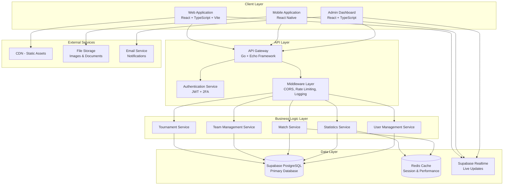
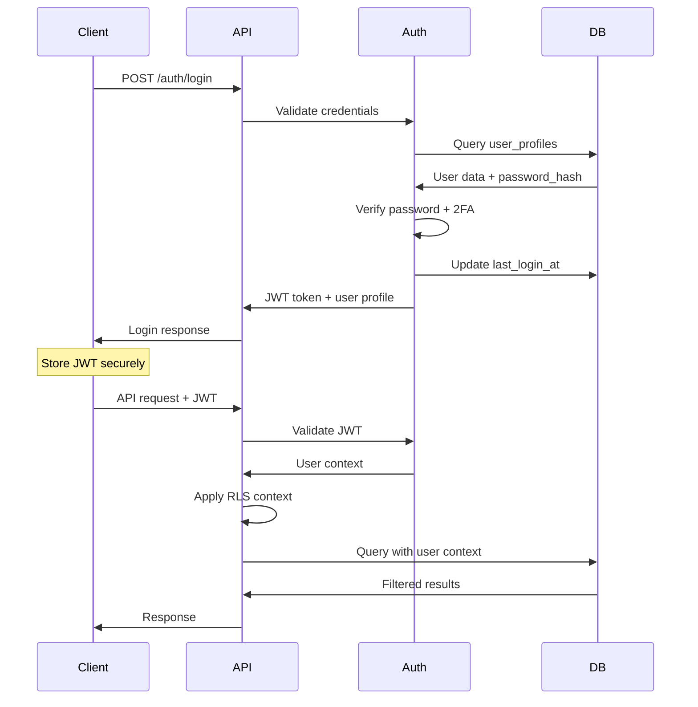

# Mowe Sport - Technical Architecture Documentation

## Overview

Mowe Sport is a comprehensive sports tournament management platform designed for local communities. This document provides detailed technical architecture information for developers, system administrators, and stakeholders.

## System Architecture

### High-Level Architecture



## Database Architecture

### Core Database Schema

The Mowe Sport platform uses PostgreSQL as the primary database with the following key components:

#### 1. User Management System
- **user_profiles**: Main user table with authentication
- **user_roles_by_city_sport**: Granular role assignments
- **user_view_permissions**: View-level access control

#### 2. Multi-Tenancy Structure
- **cities**: Geographic isolation
- **sports**: Sport-specific isolation
- **Combined isolation**: Data segregated by city + sport combination

#### 3. Tournament Management
- **tournaments**: Tournament definitions and metadata
- **tournament_teams**: Team registrations for tournaments
- **matches**: Individual match records
- **match_events**: Real-time match events

#### 4. Team and Player Management
- **teams**: Team information and ownership
- **players**: Player profiles and information
- **team_players**: Many-to-many relationship with history

#### 5. Statistics and Analytics
- **player_statistics**: Individual player performance
- **team_statistics**: Team performance metrics
- **audit_logs**: System audit trail

### Database Security Model

#### Row Level Security (RLS)
All sensitive tables implement RLS policies:

```sql
-- Example RLS Policy for Tournaments
CREATE POLICY "tournament_access_policy" ON tournaments
FOR ALL TO authenticated
USING (
    -- Super admins can access all tournaments
    (current_user_role() = 'super_admin') OR
    
    -- City admins can access tournaments in their city/sport
    (current_user_role() = 'city_admin' AND 
     city_id = current_user_city() AND 
     sport_id = current_user_sport()) OR
    
    -- Tournament admins can access their tournaments
    (admin_user_id = current_user_id()) OR
    
    -- Public tournaments are visible to all
    (is_public = TRUE)
);
```

#### Authentication Security Features
- **Password Hashing**: Custom secure hashing with salt
- **Account Locking**: Progressive locking (15min → 24hr)
- **2FA Support**: TOTP-based two-factor authentication
- **Token Recovery**: Secure password recovery with expiration
- **Session Management**: JWT-based with refresh tokens

## API Architecture

### RESTful API Design

The API follows REST principles with the following structure:

```
/api/v1/
├── auth/
│   ├── POST /login
│   ├── POST /signup
│   ├── POST /logout
│   ├── POST /refresh
│   ├── POST /forgot-password
│   ├── POST /reset-password
│   └── POST /verify-2fa
├── users/
│   ├── GET /profile
│   ├── PUT /profile
│   └── GET /roles
├── tournaments/
│   ├── GET /
│   ├── POST /
│   ├── GET /:id
│   ├── PUT /:id
│   ├── DELETE /:id
│   └── POST /:id/teams
├── teams/
│   ├── GET /
│   ├── POST /
│   ├── GET /:id
│   ├── PUT /:id
│   └── POST /:id/players
├── matches/
│   ├── GET /
│   ├── POST /
│   ├── GET /:id
│   ├── PUT /:id
│   └── POST /:id/events
└── statistics/
    ├── GET /players/:id
    ├── GET /teams/:id
    └── GET /tournaments/:id
```

### Authentication Flow



## Security Architecture

### Multi-Layer Security Model

1. **Transport Security**
   - HTTPS/TLS 1.3 encryption
   - Certificate pinning for mobile apps

2. **Authentication Layer**
   - JWT tokens with RS256 signing
   - Refresh token rotation
   - 2FA for administrative accounts

3. **Authorization Layer**
   - Role-Based Access Control (RBAC)
   - Row Level Security (RLS)
   - View-level permissions

4. **Data Protection**
   - Password hashing with bcrypt
   - Sensitive data encryption at rest
   - PII data masking in logs

5. **Application Security**
   - Input validation and sanitization
   - SQL injection prevention
   - XSS protection
   - CSRF tokens

### Security Functions

#### Password Security
```sql
-- Password strength validation
CREATE OR REPLACE FUNCTION validate_password_strength(password TEXT)
RETURNS JSONB AS $$
DECLARE
    result JSONB := '{"valid": true, "errors": []}'::JSONB;
    errors TEXT[] := ARRAY[]::TEXT[];
BEGIN
    -- Length check
    IF LENGTH(password) < 8 THEN
        errors := array_append(errors, 'Password must be at least 8 characters long');
    END IF;
    
    -- Uppercase check
    IF password !~ '[A-Z]' THEN
        errors := array_append(errors, 'Password must contain at least one uppercase letter');
    END IF;
    
    -- Digit check
    IF password !~ '[0-9]' THEN
        errors := array_append(errors, 'Password must contain at least one digit');
    END IF;
    
    -- Special character check
    IF password !~ '[!@#$%^&*(),.?":{}|<>]' THEN
        errors := array_append(errors, 'Password must contain at least one special character');
    END IF;
    
    -- Common password check
    IF password IN ('password', '123456', 'password123', 'admin', 'qwerty') THEN
        errors := array_append(errors, 'Password is too common and easily guessable');
    END IF;
    
    IF array_length(errors, 1) > 0 THEN
        result := jsonb_build_object('valid', false, 'errors', errors);
    END IF;
    
    RETURN result;
END;
$$ LANGUAGE plpgsql;
```

#### Account Locking
```sql
-- Progressive account locking
CREATE OR REPLACE FUNCTION is_account_locked_detailed(user_email TEXT)
RETURNS JSONB AS $$
DECLARE
    user_record RECORD;
    result JSONB;
BEGIN
    SELECT user_id, failed_login_attempts, locked_until, account_status
    INTO user_record
    FROM user_profiles
    WHERE email = user_email;
    
    IF NOT FOUND THEN
        RETURN jsonb_build_object(
            'locked', true,
            'reason', 'user_not_found',
            'message', 'User account not found'
        );
    END IF;
    
    -- Check account status
    IF user_record.account_status != 'active' THEN
        RETURN jsonb_build_object(
            'locked', true,
            'reason', 'account_disabled',
            'message', 'Account is disabled or suspended'
        );
    END IF;
    
    -- Check temporary lock
    IF user_record.locked_until IS NOT NULL AND user_record.locked_until > NOW() THEN
        RETURN jsonb_build_object(
            'locked', true,
            'reason', 'temporary_lock',
            'message', 'Account is temporarily locked due to failed login attempts',
            'locked_until', user_record.locked_until,
            'failed_attempts', user_record.failed_login_attempts
        );
    END IF;
    
    RETURN jsonb_build_object(
        'locked', false,
        'failed_attempts', user_record.failed_login_attempts
    );
END;
$$ LANGUAGE plpgsql;
```

## Performance Architecture

### Caching Strategy

1. **Application-Level Caching**
   - Redis for session storage
   - Query result caching for statistics
   - Real-time data caching

2. **Database-Level Optimization**
   - Strategic indexing for frequent queries
   - Materialized views for complex aggregations
   - Query optimization with EXPLAIN analysis

3. **CDN Integration**
   - Static asset delivery
   - Image optimization
   - Geographic distribution

### Critical Indexes

```sql
-- Performance-critical indexes
CREATE INDEX CONCURRENTLY idx_tournaments_city_sport_status 
ON tournaments(city_id, sport_id, status) 
WHERE status IN ('approved', 'active');

CREATE INDEX CONCURRENTLY idx_matches_tournament_date_status 
ON matches(tournament_id, match_date, status);

CREATE INDEX CONCURRENTLY idx_player_stats_tournament_goals 
ON player_statistics(tournament_id, goals_scored DESC) 
WHERE goals_scored > 0;

CREATE INDEX CONCURRENTLY idx_team_stats_tournament_points 
ON team_statistics(tournament_id, points DESC);

-- Full-text search indexes
CREATE INDEX CONCURRENTLY idx_teams_search 
ON teams USING gin(to_tsvector('spanish', name || ' ' || COALESCE(description, '')));

CREATE INDEX CONCURRENTLY idx_players_search 
ON players USING gin(to_tsvector('spanish', first_name || ' ' || last_name));
```

## Real-Time Architecture

### Supabase Realtime Integration

```javascript
// Real-time match updates
const useMatchRealtime = (matchId) => {
  const [matchData, setMatchData] = useState(null);
  const [events, setEvents] = useState([]);
  
  useEffect(() => {
    const subscription = supabase
      .channel(`match:${matchId}`)
      .on('postgres_changes', {
        event: '*',
        schema: 'public',
        table: 'matches',
        filter: `match_id=eq.${matchId}`
      }, (payload) => {
        setMatchData(payload.new);
      })
      .on('postgres_changes', {
        event: 'INSERT',
        schema: 'public',
        table: 'match_events',
        filter: `match_id=eq.${matchId}`
      }, (payload) => {
        setEvents(prev => [...prev, payload.new]);
      })
      .subscribe();
    
    return () => subscription.unsubscribe();
  }, [matchId]);
  
  return { matchData, events };
};
```

## Deployment Architecture

### Infrastructure Components

1. **Application Servers**
   - Go backend services
   - Load balancing with nginx
   - Auto-scaling based on demand

2. **Database Infrastructure**
   - Supabase PostgreSQL (managed)
   - Read replicas for performance
   - Automated backups

3. **Caching Layer**
   - Redis cluster for high availability
   - Session persistence
   - Query result caching

4. **Monitoring and Logging**
   - Application performance monitoring
   - Database performance tracking
   - Security event logging
   - Error tracking and alerting

### Environment Configuration

```yaml
# Production Environment
production:
  database:
    host: "your-supabase-host"
    port: 5432
    ssl_mode: "require"
    max_connections: 100
    
  redis:
    host: "redis-cluster-endpoint"
    port: 6379
    cluster_mode: true
    
  security:
    jwt_secret: "${JWT_SECRET}"
    jwt_expiry: "24h"
    refresh_token_expiry: "7d"
    
  performance:
    cache_ttl: "5m"
    rate_limit: "100/min"
    max_request_size: "10MB"
```

## Monitoring and Observability

### Key Metrics

1. **Application Metrics**
   - Request latency (p95, p99)
   - Error rates by endpoint
   - Throughput (requests/second)

2. **Database Metrics**
   - Query performance
   - Connection pool usage
   - Index usage statistics

3. **Business Metrics**
   - Active tournaments
   - User engagement
   - Match completion rates

### Alerting Strategy

```yaml
alerts:
  - name: "High Error Rate"
    condition: "error_rate > 5%"
    duration: "5m"
    severity: "critical"
    
  - name: "Database Connection Pool Full"
    condition: "db_connections > 90%"
    duration: "2m"
    severity: "warning"
    
  - name: "Response Time High"
    condition: "p95_latency > 2s"
    duration: "5m"
    severity: "warning"
```

## Scalability Considerations

### Horizontal Scaling

1. **Stateless Services**
   - All services designed to be stateless
   - Session data stored in Redis
   - Load balancing across multiple instances

2. **Database Scaling**
   - Read replicas for read-heavy operations
   - Connection pooling
   - Query optimization

3. **Caching Strategy**
   - Multi-level caching
   - Cache invalidation strategies
   - CDN for static content

### Performance Targets

- **Response Time**: < 2 seconds for 95% of requests
- **Availability**: 99.9% uptime
- **Concurrent Users**: Support for 100,000+ concurrent users
- **Data Consistency**: Strong consistency for critical operations
- **Real-time Updates**: < 100ms latency for live match updates

## Technology Stack Summary

### Backend
- **Language**: Go 1.21+
- **Framework**: Echo v4
- **Database**: PostgreSQL (Supabase)
- **Cache**: Redis
- **Authentication**: JWT + 2FA (TOTP)

### Frontend
- **Language**: TypeScript
- **Framework**: React 18+
- **Build Tool**: Vite
- **UI Library**: HeroUI + Tailwind CSS
- **State Management**: Zustand/Redux Toolkit

### Infrastructure
- **Database**: Supabase (managed PostgreSQL)
- **Hosting**: Cloud provider (AWS/GCP/Azure)
- **CDN**: CloudFlare/AWS CloudFront
- **Monitoring**: Prometheus + Grafana
- **Logging**: ELK Stack or similar

This technical architecture provides a solid foundation for the Mowe Sport platform, ensuring scalability, security, and maintainability while supporting the complex requirements of multi-tenant sports tournament management.